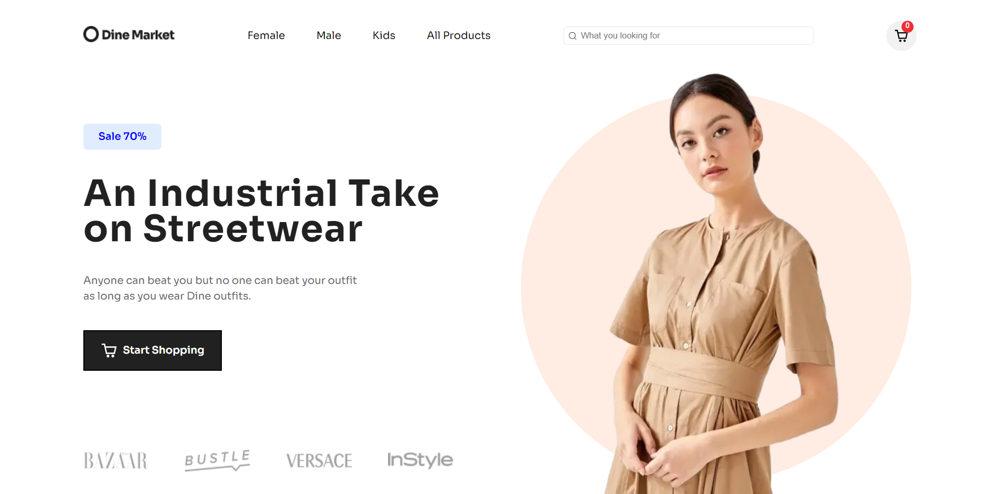
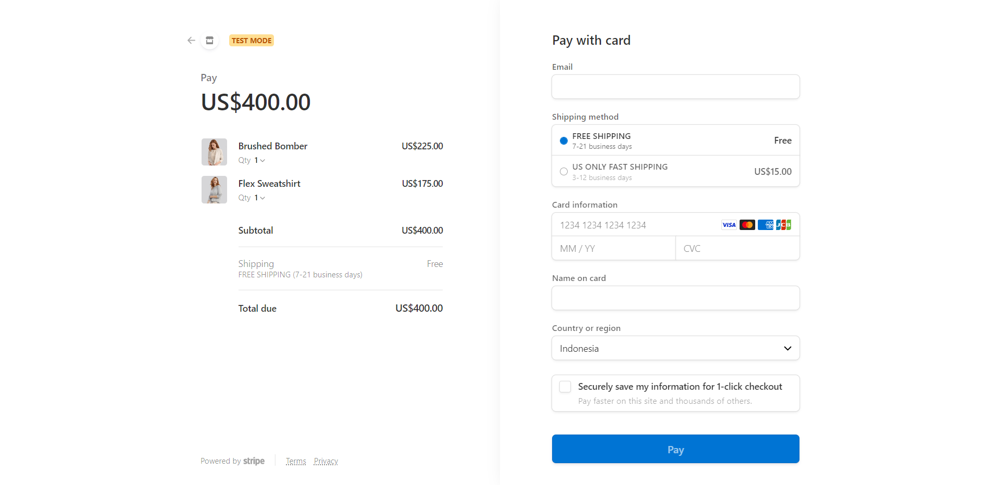
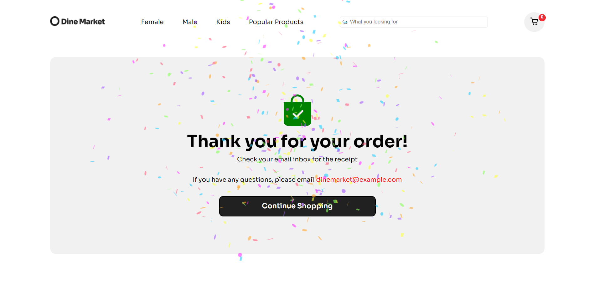

# Full Stack E-Commerce Clothing Website
This project is a full stack e-commerce website built with Next js. I created this project as an exercise to develop my web development skills, especially to learn about Next js.

## Overview

### The challenge

- Build out the project to the designs provided
- Implementing cart functionality 
- Connecting to Sanity as back end database for e-commerce
- Connecting Stripe APIs to power online payment processing for e-commerce

### Screenshot

For now the search bar is only for styling purposes and doesn't work properly yet

### Links
The live site is deployed in vercel, but it seems that vercel can't render swiper js. In the meantime i'm still trying to find a solution
- [Live Site URL](https://full-stack-ecommerce-clothing-web.vercel.app/)

### Credit
[Figma Web Design & UI kit i used for this project is design by Weird Design Studio](https://ui8.net/ui-market/products/e-commerce-ui-website-design?status=7)


### What I learned

I learned a simple css styling to put text in a background as shown below
```js
.newsletter-background {
  font-weight: 800;
  font-size: 7.5rem;
  line-height: 151px;
  color: #f2f3f7;
  position: absolute;
  z-index: -1;
}
```
By setting position to absolute and z-index to -1 (or lower than any other z-index of other elements).
z-index is a CSS property that defines the order of overlapping HTML elements. Elements with a higher index will be placed on top of elements with a lower index


I also learned how to connect stripe as payment gate for e-commerce. Full code for connecting to stripe in /pages/api/stripe.js


The confetti effect is implemented on the payment success page after the user successfully checkouts their cart


### Continued development
The development of this project can be continued by adding a search filter functionality, an e-commerce newsletter, activate the slider function for product section in homepage. In the near future, I'm going to explore react js search filters and maybe add that functionality myself.


## Acknowledgments

A HUGE Thanks to Javascript Mastery youtube channel which really helps me in learning about web development. I recommend this channel to everyone who wants to learn about web development and javascript


## Getting Started

To run the development server:

```bash
npm run dev
```
